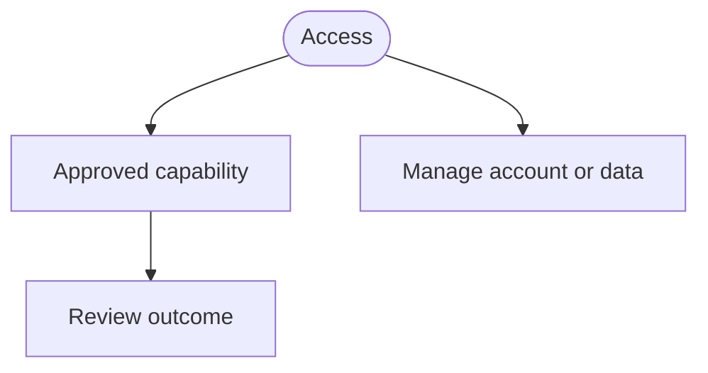
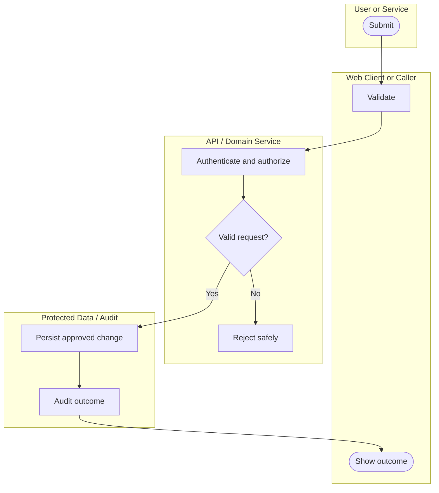

# Business Flow Catalog

**Status:** Product-flow template. Add only approved user journeys.
**Authority:** [PRD.md](PRD.md) is authoritative for product intent; [ARCHITECTURE.md](ARCHITECTURE.md) is authoritative for controls; the runbooks are authoritative for incidents and releases.
**Compatibility:** Use standard Mermaid `flowchart TB` syntax with top-level subgraphs as swimlane-style ownership groups. Do not use `swimlanes-beta`.

## 1. How to read and maintain flows

- Give every approved release capability one analysis-register entry and one end-to-end diagram.
- Keep each diagram to 3–4 ownership lanes and 6–9 nodes: one happy path and at most one safe rejection path.
- Use short verbs such as `Submit`, `Authorize`, `Persist`, `Audit`, and `Reject safely`. Do not include endpoints, schema names, vendors, secrets, or unresolved product conditions.
- Describe loading, empty, error, success, and permission-denied UI states in [UI_UX.md](UI_UX.md), not in diagrams.
- Do not duplicate incident or release steps; use [Incident Response](runbooks/INCIDENT_RESPONSE.md) and [Release and Rollback](runbooks/RELEASE_ROLLBACK.md).

## 2. Capability map

Replace this map once the first release is approved.

## 3. Flow analysis register

| ID | Journey and trigger | Authorization and data changed | Audit and exit | Exception | PRD |
| --- | --- | --- | --- | --- | --- |
| BF-01 | **TBD:** First protected journey | **TBD:** Actor, resource boundary, and data outcome | **TBD:** Minimal audit and successful exit | Reject safely | FR-001 |

## 4. Conceptual ownership

| Concept | Owner and purpose | Derived or audit behavior |
| --- | --- | --- |
| Account/tenant and profile | Defines the protected ownership boundary and approved preferences. | Authentication and sensitive profile actions create minimal audit records. |
| Product resource | **TBD:** Define source-of-truth data and permitted operations. | **TBD:** Define derived views and correction/deletion effects. |
| Projection or aggregate | **TBD:** Define any derived, account-scoped view. | Refresh/recalculate only from approved source data. |
| Minimal audit event | Records actor, time, action, target type/identifier, outcome, and correlation ID. | Never includes secrets or sensitive payloads. |

## 5. BF-01 — Protected action template

Add the next flow only after its PRD requirement is approved.
